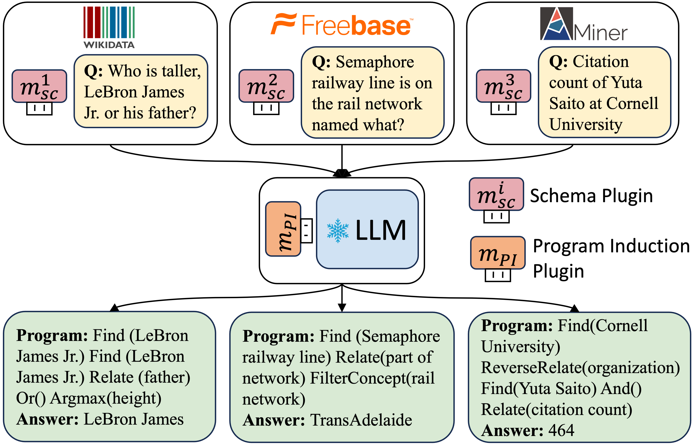

# [EMNLP2024] KB-Plugin: A Plug-and-play Framework for LLMs to Induce Programs over Low-resourced KBs
[](https://github.com/Neo-Zhangjiajie/ProbTree/issues)
[](https://www.python.org/)
[](https://arxiv.org/pdf/2402.01619.pdf)

>Program induction (PI) has become a promising paradigm for using knowledge bases (KBs) to help large language models (LLMs) answer complex knowledge-intensive questions. Nonetheless, PI typically relies on a large number of parallel question-program pairs to make the LLM aware of the schema of the given KB, and is thus challenging for many low-resourced KBs that lack annotated data. To this end, we propose **KB-Plugin**, a plug-and-play framework that enables LLMs to induce programs over any low-resourced KB. Firstly, KB-Plugin adopts self-supervised learning to encode the detailed schema information of a given KB into a pluggable module, namely **schema plugin**. Secondly, KB-Plugin utilizes abundant annotated data from a rich-resourced KB to train another pluggable module, namely **PI plugin**, which can help the LLM extract question-relevant schema information from the schema plugin of any KB and utilize this information to induce programs over this KB. Experiments on five heterogeneous KBQA datasets show that KB-Plugin achieves better or comparable performance with 25x smaller backbone LLM compared to SoTA PI methods for low-resourced KBs, and even approaches the performance of supervised methods.

This is the accompanying code & data for the paper ["KB-Plugin: A Plug-and-play Framework for Large Language Models to
Induce Programs over Low-resourced Knowledge Bases"](https://arxiv.org/pdf/2402.01619.pdf).

<div  align="center"> 

</div>

## Plugin Learning and Transfer Framework
<div  align="center"> 

</div>

## File Structure
```
ProbTree/
├─  data/: put downloaded datasets here
├─  checkpoints/: put trained or downloaded plugin checkpoints here
├─  models_hf/: put your Llama2-7B model here
├─  source_kqapro/: code for training source domain schema plugins and PI plugin using KQA Pro
├─  transfer_freebase/: code for experiments on GrailQA, GraphQ, and WebQSP
└──  transfer_domain_specific/: code for experiments on MetaQA and SoAyBench
```

## Data & Model Preparation

To run experiments, please first download [Llama2-7B](https://huggingface.co/meta-llama/Llama-2-7b) model and put it under `./models_hf`.

Our data and plugin checkpoints can be download from [here](https://drive.google.com/drive/folders/1eAFR4X17XX7W40o0k134PDCf_m0brp7R?usp=sharing).

To conduct evaluation on GrailQA, GraphQ, and WebQSP, please follow [Freebase Setup](https://github.com/dki-lab/Freebase-Setup) to set up a Virtuoso triplestore service. After starting your virtuoso service, replace the url in `./transfer_freebase/utils/sparql_executer.py` with your own.
## Training on KQA Pro

### KB Generation and Data Augmentation
```bash
cd ./source_kqapro/sft_llama
```

Use KQA Pro to generate 16 source KBs with different schemas and corresponding augmented data. 
```bash
python get_diff_kb.py
```

### Source KB Schema Plugin Learning
Firstly, sample factual triples from each source KBs to generate training data.
```bash 
python get_el_data.py --metaqa 0 # set 1 to remove relations in metaqa
python process_el_data.py --metaqa 0 
```

Secondly, train an individual schema plugin for each source KB.
```bash
python get_el_data.py --metaqa 0 
python process_el_data.py --metaqa 0 
bash train_el_lora_0-7.sh
bash train_el_lora_8-15.sh
```

### PI Plugin Learning
```bash
python mix_pi_data.py --metaqa 0
python process_pi_data.py --metaqa 0
bash train_pi_plugin.sh
```

## Transfer the PI Plugin to Other KBs

### Target KB Schema Plugin Learning
Train the schema plugin for each target KB.
```bash
cd ./transfer_freebase/sft_llama
python process_el_data.py --dataset grailqa # graphq, webq
bash train_el_lora.sh 

cd ./transfer_domain_specific/sft_llama
python process_el_data.py --dataset metaqa # soay
bash train_el_lora.sh 
```

### Evaluation
```bash
cd ./transfer_freebase
python eval_kb_plugin.py --dataset grailqa # graphq, webq

cd ./transfer_domain_specific
python eval_kb_plugin.py --dataset metaqa # soaybench
```

## Citation

If you find our work useful, please consider citing KB-Plugin:

```
@article{zhang2024kbplugin,
      title={KB-Plugin: A Plug-and-play Framework for Large Language Models to Induce Programs over Low-resourced Knowledge Bases}, 
      author={Jiajie Zhang and Shulin Cao and Linmei Hu and Ling Feng and Lei Hou and Juanzi Li},
      journal={arXiv preprint arXiv:2402.01619},
      year={2024}
}
```
